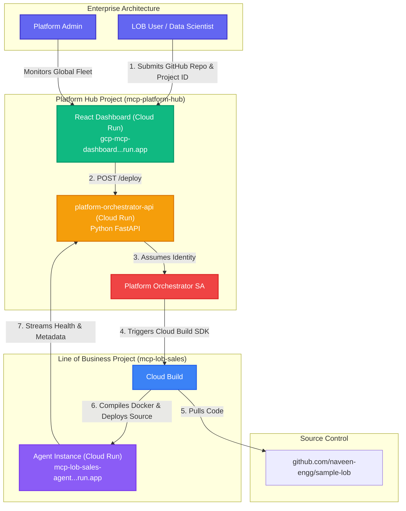
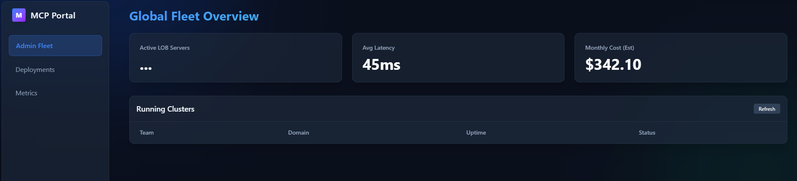
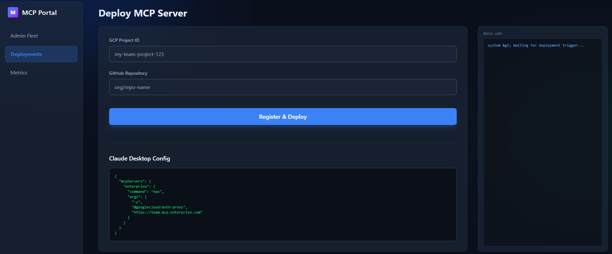

# MCP Enterprise Control Plane

An orchestration platform built to centrally manage, deploy, and monitor Model Context Protocol (MCP) agents across multiple Line of Business (LOB) environments in Google Cloud.

**Suggested Repository Name:** `gcp-mcp-control-plane`

---

## 🏗 Architecture & Flow

### Components

#### 1. React Dashboard (`mcp-dashboard-(url).run.app`)
The visual front-door. LOB users use this portal to register their Google Cloud project ID and their MCP Agent Github Repository.

#### 2. The `platform-orchestrator-api`
**What is its purpose?** 
In a standard organization, Central IT cannot simply give 500 different LOB developers `Cloud Run Admin` and `Organization Admin` roles. It's a massive security risk. Instead, developers authenticate to the Dashboard, which communicates with the Orchestrator API. The Orchestrator API holds the highly-scoped Service Account. It validates the user's intent, creates a secure deployment pipeline footprint, and handles all CI/CD Cloud Build push events without exposing GCP keys to the end-users.

#### 3. Line of Business Modules
The destination projects where the actual AI Agents run (`sample-lob`). The output is a secure Service URL that LOB owners can configure Claude Desktop with via OAuth parameters.

---

## ✨ Key Advantages

- **Centralized Multi-Tenant Management**: A single control plane to orchestrate MCP agents across isolated LOB projects.
- **Secure IAM Proxying**: The `platform-orchestrator-api` prevents the need for broad IAM permissions for end-users by acting as a secure intermediary.
- **Automated CI/CD Pipelines**: One-click deployment from GitHub to Cloud Run using optimized Google Cloud Build steps.
- **Real-time Observability**: Track deployment traces and global fleet metrics directly from a premium, high-fidelity dashboard.
- **Scalable Hub-and-Spoke Model**: Easily onboard new LOBs with minimal configuration while maintaining strict resource isolation.
- **Developer-Centric Experience**: Simplified agent registration and automatic generation of Claude Desktop configurations.

---

## 📸 UI Screenshots

### Global Fleet Overview
Displays real-time metrics and the status of all active MCP agent clusters across the enterprise.

### MCP Agent Deployment
A streamlined interface for LOB developers to register projects and trigger automated builds.

---

---

## 🔒 Decommissioning Notice

The live testing environment for this project has been decommissioned. All GCP resources (Cloud Run services, IAM members, and Service Accounts) have been destroyed using Terraform and the `gcloud` CLI as of the final commit. 

For local development and testing, refer to the **Architecture & Flow** section to provision your own Hub-and-Spoke model in Google Cloud.

