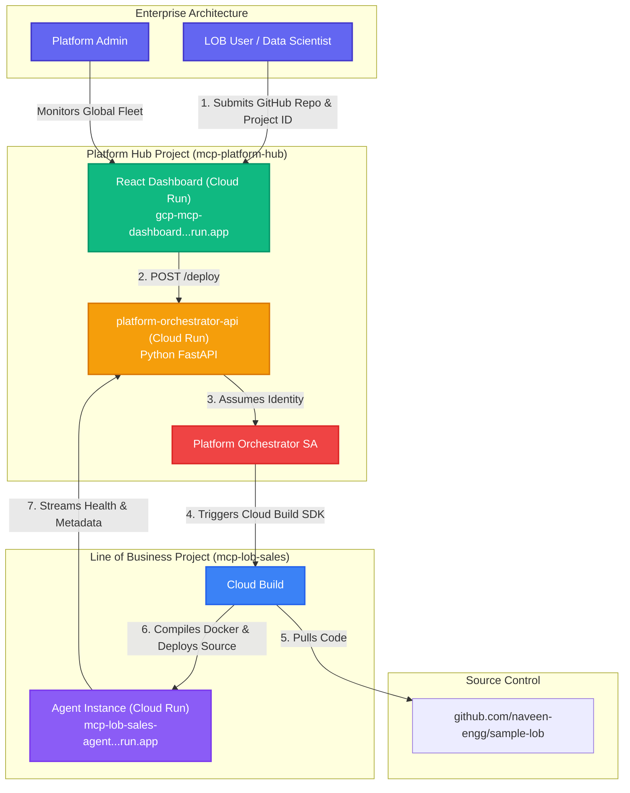

# MCP Enterprise Control Plane

An orchestration platform built to centrally manage, deploy, and monitor Model Context Protocol (MCP) agents across multiple Line of Business (LOB) environments in Google Cloud.

**Suggested Repository Name:** `gcp-mcp-control-plane`

---

## 🏗 Architecture & Flow

### Components

#### 1. React Dashboard (`mcp-dashboard-(url).run.app`)
The visual front-door. LOB users use this portal to register their Google Cloud project ID and their MCP Agent Github Repository.

#### 2. The `platform-orchestrator-api`
**What is its purpose?** 
In a standard organization, Central IT cannot simply give 500 different LOB developers `Cloud Run Admin` and `Organization Admin` roles. It's a massive security risk. Instead, developers authenticate to the Dashboard, which communicates with the Orchestrator API. The Orchestrator API holds the highly-scoped Service Account. It validates the user's intent, creates a secure deployment pipeline footprint, and handles all CI/CD Cloud Build push events without exposing GCP keys to the end-users.

#### 3. Line of Business Modules
The destination projects where the actual AI Agents run (`sample-lob`). The output is a secure Service URL that LOB owners can configure Claude Desktop with via OAuth parameters.

---

## 🚀 Live Testing URLs

*   **Platform Dashboard (LOB & Admin UI):** https://mcp-dashboard-668628440470.us-central1.run.app 
*   **Orchestrator API (Backend):** https://platform-orchestrator-api-668628440470.us-central1.run.app

### How to Deploy an Agent
1. Visit the Platform Dashboard URL.
2. Navigate to **Deployments**.
3. Input `mcp-lob-sales` for the GCP Project ID.
4. Input `https://github.com/naveen-engg/sample-lob` for the Repo.
5. Click **Deploy** to observe the Orchestrator push the Cloud Build instructions directly to the target environment.
